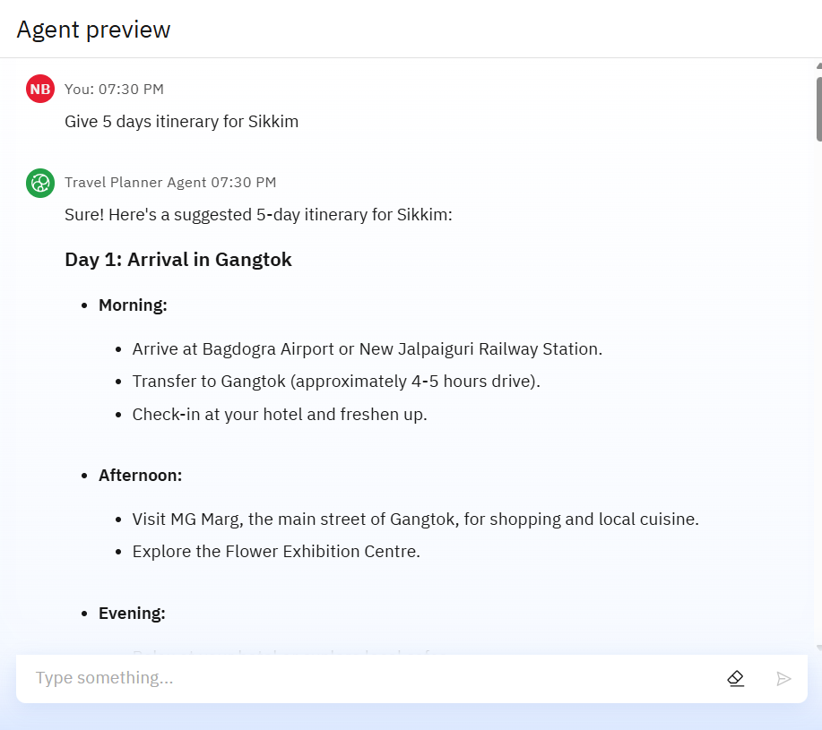
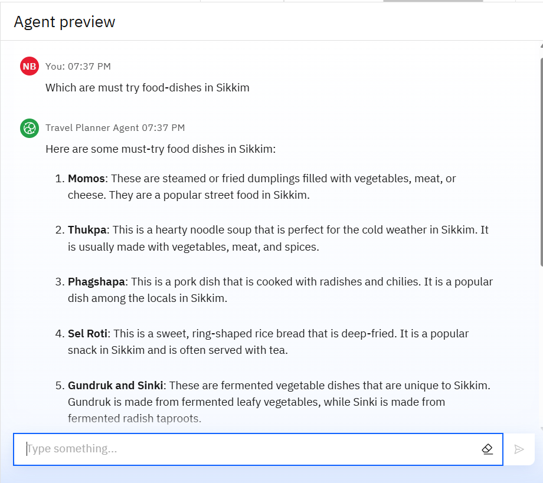
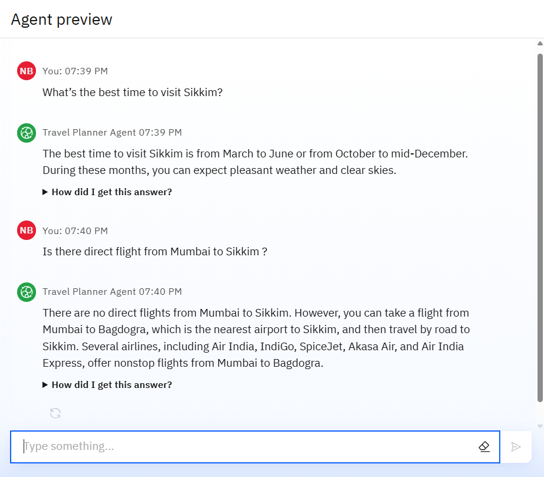

# 🧳 Travel Planner AI Agent -By Nirjara Bhus 
*A smart, AI-powered travel assistant built with IBM Granite and Cloud Lite* 

---

## 📌 Overview  
The **Travel Planner AI Agent** simplifies trip planning by leveraging **IBM Granite models** and **IBM Cloud Lite** to deliver personalized itineraries, real-time data integration (weather, maps, bookings), and dynamic scheduling. Designed for travelers, agencies, and businesses, it transforms complex planning into a seamless experience.

---

## ✨ Features  
- **🧠 Personalized Recommendations**: Tailored trips based on budget, interests, and constraints.  
- **🌐 Real-Time Data**: Live weather, maps, and local attraction updates.  
- **🛠 Agentic AI**: Goal-driven planning with IBM Granite and ReAct framework.  
- **📚 RAG-Based Responses**: Pulls data from custom travel docs (via IBM Cloud Object Storage).  
- **☁️ Cloud-Native**: Fully deployed on IBM Cloud Lite (Watsonx AI Studio/Runtime).  

---

## 🛠️ Technologies Used  
| **Category**       | **Tools/Services**                          |  
|---------------------|--------------------------------------------|  
| **AI/ML**           | IBM Granite, LangChain, ReAct              |  
| **Cloud**           | IBM Cloud Lite, Watsonx AI Studio,Runtime  |  
| **Storage**         | IBM Cloud Object Storage (COS)             |  
| **Deployment**      | IBM Cloud Agent Lab                        |  

---

## 🚀 Installation & Usage  
### Prerequisites  
- IBM Cloud Lite account ([Sign up here](https://cloud.ibm.com/))

---
## Watch Demo video of Travel Agent

---

## PPT of AICTE Project
📑 **Project Presentation**: [View PPT on Google Slides](https://docs.google.com/presentation/d/1Y2DiT1LV8aoOnirqCiIVrS1PXz_YQd3W/edit?usp=drive_link)

📥 [View/Download as PowerPoint (.pptx)](https://docs.google.com/presentation/d/1Y2DiT1LV8aoOnirqCiIVrS1PXz_YQd3W/export/pptx)

---

## 🖼️ Results

### One

### Two

### Three

---

## ✨ WOW Factors
Agentic AI with IBM Granite – Smart, goal-driven travel planning

Personalized Itineraries – Based on user budget, interests, and constraints

Real-Time Data Integration – Live weather, maps, and local attractions

RAG-Based Responses – Pulls relevant info from custom travel docs using Object Storage

Tool-Using Agent – Can act (e.g., suggest bookings, reroute trips), not just chat

Prompt Lab Tuning – Refined prompts via Watsonx.ai for natural, accurate conversations

Cloud-Native Deployment – Built entirely on IBM Cloud Lite, lightweight and scalable

---

## 🎯 End Users
General Travelers – Vacationers, backpackers, solo or family trips

Business Professionals – Optimized trip planning for meetings and events

Travel Agencies – As a digital assistant for faster client service

Tour Operators – For automated itinerary generation and updates

Hotels & Resorts – To assist guests in planning local experiences

Developers & Startups – As a foundation for travel-based AI applications

--- 

## 🔮 Future Scope
Mobile App Integration – Extend usability through Android/iOS platforms

Multilingual Support – Expand global reach using Granite multilingual models

Voice Interaction – Add voice-based planning using speech-to-text APIs

Third-party Booking APIs – Integrate with MakeMyTrip, IRCTC, etc.

User History & Memory – Save preferences for personalized recurring trips

Offline Mode – Enable travel planning in low or no-network areas

Autonomous Planning – Automate rescheduling, updates, and conflict handling in real time

---

